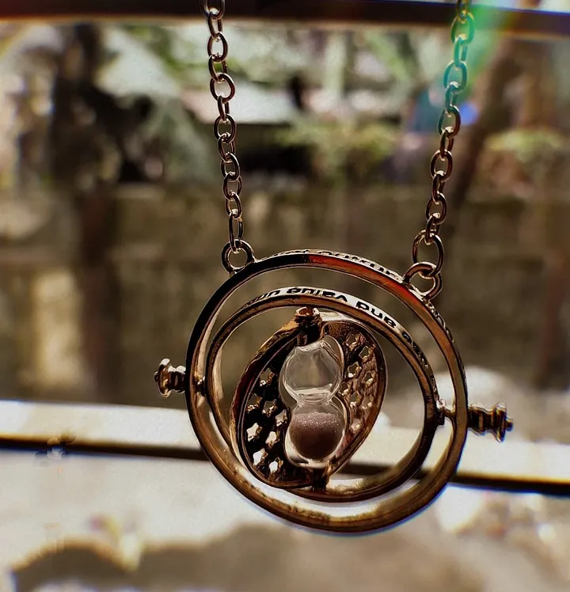

वो छोटा सा मकान  
वो नादानियों से भरा खुला आँगन  
वो कहानियों से भरा छत  

वो खुले आसमान के नीचे सोना  
तारों, सप्तऋषियों से बातें करना  
और सूरज की पहले किरण से जागना  
 
बचपन को गुजरते देखा  
और कुछ इस तरह से  
वक़्त को गुजरते देखा।  

 
<!--

 -->

ये काली दुनिया की बातों में आकर  
खुद को गोरा करते देखा   
अजनबी को मित्र   
मित्रता को मोह्हबत   
और मोह्हबत को अजनबी होते देखा    

बच्चे को किशोर में बदलते देखा  
और कुछ इस तरह से  
वक़्त को गुजरते देखा।  

 

सफलता, असफलता ,नाकामियां, खामियां  
स्वयमं को स्वयमं के विचारों में  
उलझते देखा  

अपने अंदर के इन्सान को  
एक छोटे बच्चे की तरह  
फुट-फुट कर रोते देखा  
स्वयमं की परछायीओं से लड़ते देखा  

और उसी स्वयमं को  
फिर से खड़े होकर चल देने को  
हौसला देते हुए देखा  

एक सहमे हुए नदी को समुद्र होते देखा  
किशोर को वयस्क होते देखा  
और कुछ इस तरह से  
वक़्त को गुजरते देखा।  

 

खुद के जायज अधिकार के लिए  
खुद को अकेले लड़ते देखा  
अपनों को अपनों से लड़ते देखा  
और फिर खुद को खुद ही दिलासा देते देखा  
 
वयस्क को बूढ़ा होते देखा  
और कुछ इस तरह से  
वक़्त को गुजरते देखा।  

 

हर छोटी छोटी बात पे  
माँ को ज़िद करते देखा  
और फिर एक दिन  
बच्चे की तरह, माँ को घुटने के बल चलते देखा  

बुढ़ापे को बचपन में बदलते देखा  
और कुछ इस तरह से  
वक़्त को गुजरते देखा।  

 

उस छोटे से मकान में  
माँ को बीमार देखा  
डॉक्टर के भेष में यमराज को आते देखा  

गुलाबी कागज़ की सीधी लकीर में  
मैंने सांस को रुकते देखा  

लोगों को “पर्याप्त” मात्रा में  
अश्रु बहाते देखा  
कठिन समय का फयदा उठाते देखा  
और मैंने खुद को ख़ुदा से  
एक ज़िंदगी की भीख मांगते देखा  

श्मशान में कई बुढ़ापे को जलते देखा  
और माँ के ना रहने पर  
कुछ इस तरह से  
वक़्त को थमते देखा।  

 

बच्चे को किशोर  
किशोर को वयस्क  
वयस्क को बूढ़ा  
और बूढ़े को बच्चा होते देखा  
ख़ुशी के वक़्त को गुजरते देखा  
गम के वक़्त को थमते देखा  
और इस तरह मैंने जीवन चक्र देखा।
<figure>

<figcaption style="font-size:12px">Image Source: Internet</figcaption>
<!--  
<figcaption style="display:block;text-align: center;font-size:15px"> Source: Internet</figcaption>
<figcaption style="margin:auto; text-align: center;font-size:15px">Source: abc</figcaption> -->

</figure>