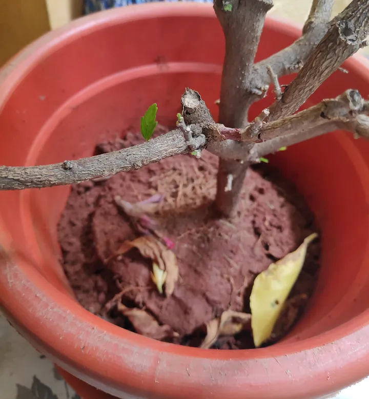
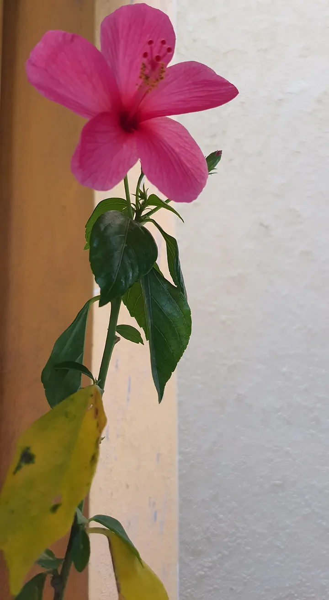

I have read somewhere that <i>“when flowers bloom, so does hope !” </i> And it’s true. Nature has its own way of inspiring us, if we are willing to look in that direction. These days, there is a lot of talk about “Monday blues.” But in my opinion, if you have focused your eye sight on the blues, then you will see only blues. If not, you will see many colours. Like, right now I can see, the bare brown. The tender green. The warm, cosy yellow and the pinkish red ; the way hibiscus is blushing right now.

<figure>

<figcaption style="font-size:15px; text-align:center;">   <i>Strong yet Tender [Image by author] </i></figcaption>
</figure>

The teeny-tiny, new-born leaf on the bare, bold brown stem of the hibiscus shows us that you can be strong, rough and tough as per today’s world, but at the same time you can be gentle. Have your strong side ready for those who belittle you. But for yourself, be gentle and vulnerable.

In a world full of filters, being strong is the only choice we have, but being unfiltered, vulnerable, and tender, like this leaf, is what adds to your beauty!

As the sun started to rise and the fog began to lift, breezy air tickled the leaves, sunrays hugged the silvery pearl dewdrops with warmth, and petals started to blush more in pinkish-red. As she blushes, all the silky vein was being reflected to my eye through rays. She shows her vulnerability with grace and boldness.

<figure>

<figcaption style="font-size:15px; text-align:center;"> <i>Letting go is the true nature of nature! [Image by author]</i></figcaption>
</figure>

While I was hypnotised by all those bright colours, I saw a pale yellowish-orangish-green leaf fall gracefully into the vase. It lies there in peace. I kept gazing at the leaf and realised that fall can be pleasing too. So, why do we humans try to hold on to pain when we know that <rw-custom-highlight-text> <i> letting go is the true nature of nature! </i> </rw-custom-highlight-text> 

Still lost in thought, my eyes caught the roots. It spread all around the vase, holding all the mud together like a closed, strong fist. Hibiscus knows that at some point she has to let go of her leaves, buds, and petals, but as she knows how strong her roots are, she is capable of having more leaves and buds and is ready to bloom colourfully again.

Likewise, in life, sometimes we may have to let go of people or situations, but as long as we know what our roots are, we can start again and bloom too. So, if you know how to love, you can love again. May be this time you can start by loving yourself first. If you know how to work hard, you can get that interview cleared. Whatever the challenge in life, <rw-custom-highlight-text> <i>know your roots and bloom again. </i> </rw-custom-highlight-text>

As I took my last sip of tea, mentally recording the whole mesmerizingly colourful Monday, I took out my mobile camera and tried to capture this beauty digitally.

So that’s how I painted my Monday, not with blue but with green, brown, yellow and blushing in pinkish red.
