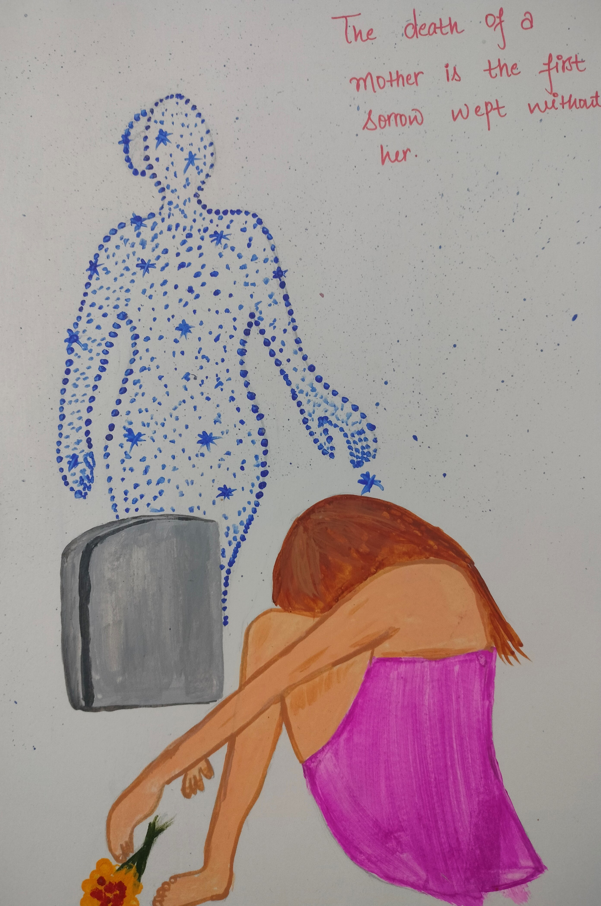

Hey grief, have you wondered where do they go ?  
At what places they go ?  
How does that afterlife place look like ?  
Is it so peaceful there,  
That they don't wanna return here ?  
What is it, grief ? 

Are they angry with us ?  
Why don't they speak out ?  
Or send any signal to us ?  
Is it like they are sending,  
But we are unable to receive it ?  
What is it, grief? 

How long do we have to wait?  
5 seconds ? 5 minutes ? 5 days ?  
5 months ? 5 years ?  
Or forever ? 

We are in the 21st century, Grief.  
There is so much connectivity around.  
Mobile, Instant messages, Snapchat,  
Audio Call, Video call,   
And even Meta World too.  
But still no connectivity with afterlife ?  
Why, grief ?

In which dimensions are they ?  
If they can't come to us,  
Can't we go there ?  
You & me grief, together? 

Why don't they call us anymore?  
No messages, No letters, Nothing.  
The phone never rings with that same voice.  
Why is it, Grief ?

Are they angry with me ?  
I should be angrier, right?   
I keep waiting and waiting and waiting   
And they are not responding to anything.  

When the time comes and when I go there too, 
Will they be there ?  
Waiting for me,   
Like I am waiting for them to come ?

Is there any hope of meeting them there ?   
Or there they will also leave me ?  
And will be gone to some other places ?

Am I that bad ?  
They don't wanna see me ever ?  
Am I that bad person, grief? 

At least they can talk to me   
On the day they brought me to the world - on my birthday ?  
No ? Okay, dont even talk !  
Give me their address,  
I will visit them.

Grief, why this silence is full of agonizing scream ?  
The heart which feels heavier than rock.  
Numb body, Lumps in throat,  
Neither able to sallow nor disgorge it ! 

Are we just going to live   
with this agony forever?  
That's it, Grief?   

Who will answer to my bewilderness 'whys' ?

Slowly, all of them are going.  
But not telling us where? 

What's this mystery about the afterlife, Grief ?  

As I wait for the universe to answer - <i>The mystery of afterlife. </i>   
I console myself for   
their physical non-existence.  
A sudden heavy, strong waves of memory comes  
And hit me with full force,  
Right in my heart.

A gut wrenching pain,   
Makes me more desperate for their love,  
Just need to meet them once,  
See them, touch them,   
Or at least listen to them ! 

<!-- As my mother has quoted -->
As <i> she </i> has quoted -    <rw-custom-highlight-text>
<i>"We have to face adversity as an asset."   
"विप्पति को संपत्ति समझ झेलना है।" </i> </rw-custom-highlight-text>

I, A 30 year old child  
have nothing to offer   
Except the tears of mine  
For the love we shared,  
While you were here, together! ❣️

<!-- But as the saying goes -    -->
<figure>

<figcaption><i>Art by Author</i> </figcaption>
<figure>

